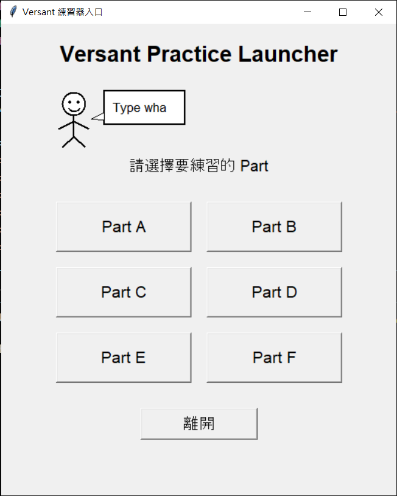
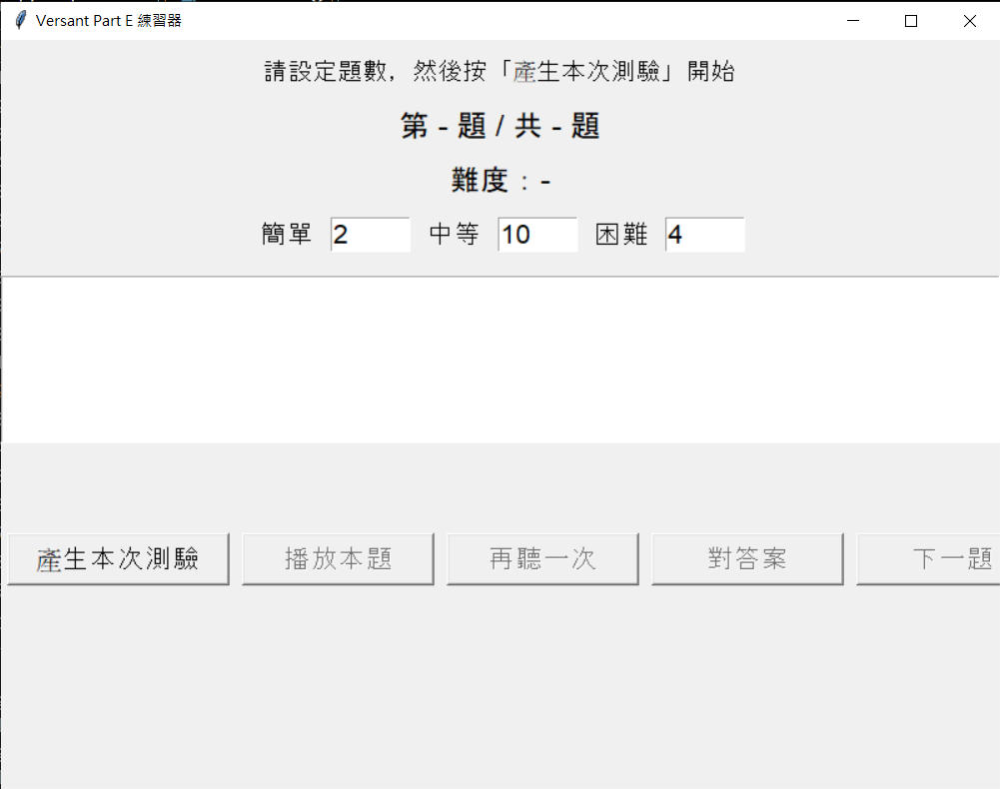
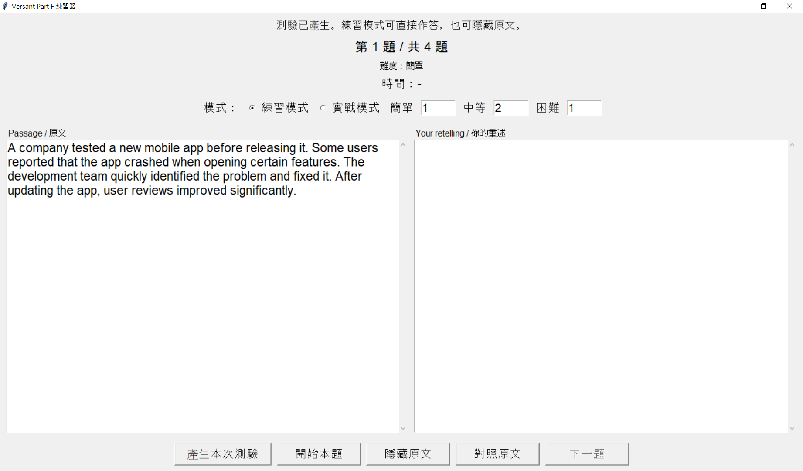

# Versant 4 Skills Essentials Test 模擬器

## 1. 前言

<table>  <tr>    <td align="center">      <br>      <sub>Main launcher</sub>    </td>    <td align="center">      <br>      <sub>Part E: Dictation practice</sub>    </td>    <td align="center">      <br>      <sub>Part F: Read and retell practice</sub>    </td>  </tr></table>

## 1.1 為什麼我製造了這個專案

在只餘短短一周準備時間的急迫情境下，最有效的練習絕對是模擬考。但官方一次考試要賣15美金，實在下不去手，於是做了這個遊戲之作。其中語音轉文字部分並未完成，只以鍵盤輸入替代，Part A 部分暫時先和 Part E 混用，只要你用說的而不是用打的，Dictation 也可以是 Repeat，又，Part D 感覺無甚意義，也暫時略過。總之，略顯粗糙，還望海涵。但從後來看，花一天時間製作這個專案絕對是值得的。又，因為鄙人已經考完了，未來不會再繼續更新這個專案。但或許會有全新的英文練習器發布，那會是比市面上任何英文練習 APP 都不同的全新感受。

------

## 1.2 Versant 4 Skills Essential Test 考試形式簡介

Versant 4 Skills Essential Test 是 Pearson 的英語能力測驗之一，主要評估考生在日常與職場情境中使用英語的能力。測驗涵蓋四項核心技能：Speaking、Listening、Reading、Writing，最後會產生 Overall score 與四個分項成績。官方指南說明，整場測驗約 30 分鐘，題目依題型分成六個 Part，每個 Part 都會先提供說明與範例題，正式作答時每一題都有時間限制。

官方題型如下：

| Part   | 題型                   | 主要測驗能力        | 官方題數 | 作答形式                                                     |
| ------ | ---------------------- | ------------------- | -------- | ------------------------------------------------------------ |
| Part A | Repeat                 | Speaking            | 16       | 聽句子後，口頭重複聽到的內容。                               |
| Part B | Sentence Builds        | Speaking            | 8        | 聽到被打散順序的短片語後，重新組成完整句子並說出來。         |
| Part C | Conversations          | Listening           | 12       | 聽一段短對話後，根據問題回答一個單字或短語。                 |
| Part D | Sentence Completion    | Reading             | 18       | 閱讀有缺字的句子，輸入最適合的一個字。                       |
| Part E | Dictation              | Listening / Writing | 14       | 聽一句話，逐字輸入聽到的內容。                               |
| Part F | Passage Reconstruction | Reading / Writing   | 2        | 閱讀短文 30 秒後，短文消失，考生需在 90 秒內用自己的話重建內容。 |

這類測驗的難點並不只在單題難度，而在於「即時處理能力」。考生需要在短時間內完成聽辨、短期記憶、句法重組、語意理解、輸入或口說輸出。正式測驗中不可自由回到前一題，也不能重錄口說答案；若時間結束，系統會保存當下答案並進入後續流程。

------

## 1.3 專案介紹

本專案是一個以 Python 製作的 Versant 4 Skills Essential Test 練習器，目標是提供可重複使用、可自行擴充題庫、可離線練習的桌面版模擬環境。

專案目前以 `tkinter` 製作圖形介面，並以 `pygame` 播放預先生成的 MP3 音檔。需要語音的題型會先使用 `edge-tts` 將題庫文字轉成音檔，再由各 Part 的練習器讀取對應題庫與音檔進行練習。

目前已完成的模組包括：

| 模組   | 對應官方題型           | 目前實作方式                                                 |
| ------ | ---------------------- | ------------------------------------------------------------ |
| Part B | Sentence Builds        | 播放打散順序的 chunks，使用者輸入重組後的完整句子，系統提供文字相似度比對。 |
| Part C | Conversations          | 播放男女對話與問題，使用者輸入答案，系統提供參考答案與相似度比對。 |
| Part E | Dictation              | 播放句子，使用者輸入聽到的內容，系統提供正確答案與相似度比對。 |
| Part F | Passage Reconstruction | 顯示短文，支援練習模式與實戰模式；實戰模式模擬 30 秒閱讀與 90 秒重述。 |

本工具的設計重點是「練習流程」而非「官方評分」。它可以用來熟悉題型、訓練反應速度、累積聽寫與短期記憶能力，也可以作為自建題庫的練習平台。不過，本專案不是 Pearson 官方產品，產生的相似度分數也不等同於 Versant 官方成績。

------

## 1.4 尚未完成與可改進部分

本專案目前仍是個人備考用途的原型工具，尚未完整覆蓋 Versant 4 Skills Essential Test 的所有官方題型。

目前尚未完成的部分如下：

| 項目                       | 狀態     | 說明                                                         |
| -------------------------- | -------- | ------------------------------------------------------------ |
| Part A Repeat              | 尚未實作 | 官方 Part A 需要聽句子後口頭重複。本專案目前尚未加入錄音、語音辨識或發音評估功能。 |
| Part D Sentence Completion | 尚未實作 | 官方 Part D 是閱讀缺字句並輸入一個字。本專案目前尚未建立對應 GUI 與題庫格式。 |
| 官方式口說評分             | 尚未實作 | Part B、Part C 在正式測驗中偏向口說作答；本專案目前改以文字輸入與相似度比對替代。 |
| 自動語音辨識               | 尚未實作 | 尚未整合 Whisper、faster-whisper 或其他 ASR 工具。           |
| 正式測驗模式               | 部分實作 | Part F 已有 30 秒閱讀與 90 秒作答模式，但其他 Part 尚未完全模擬正式測驗的不可重播、限時跳題與整回合流程。 |
| 答題紀錄                   | 尚未實作 | 目前不會自動保存練習結果、錯題紀錄或長期分數趨勢。           |
| 題庫檢查工具               | 尚未實作 | 題庫格式錯誤通常會在執行練習或產生音檔時才被發現。           |
| 打包發布                   | 尚未實作 | 目前仍需使用 Python 執行，尚未打包成 Windows `.exe`。        |

未來可優先改善的方向包括：統一各 Part 的共用邏輯、加入錯題本與答題紀錄、支援自動語音辨識、補齊 Part A 與 Part D、建立完整的正式測驗模式，並將整個專案打包成更容易安裝與執行的版本。

---

## 2. 功能總覽

| 功能 | 說明 |
|---|---|
| 主選單入口 | 使用 `main.py` 啟動 GUI，從同一個畫面選擇已實作的 Part。 |
| 分 Part 練習 | 每個 Part 以獨立資料夾管理，包含自己的題庫、程式與音檔。 |
| 難度分層 | 題庫分為 `easy`、`medium`、`hard`。 |
| 自訂題數 | 使用者可在 GUI 中設定每次抽取各難度的題數。 |
| 隨機抽題 | 每次產生測驗時，會從各難度題庫中隨機抽題。 |
| 預生成音檔 | Part B、Part C、Part E 先用 `build_audio.py` 生成 MP3。 |
| 音檔播放 | 使用 `pygame` 播放預先生成的 MP3。 |
| 簡易答案比對 | Part B、Part C、Part E 提供文字相似度百分比。 |
| Part F 限時模式 | Part F 支援 30 秒閱讀與 90 秒作答的實戰模式。 |

---

## 3. 使用技術

| 類別 | 工具 |
|---|---|
| 程式語言 | Python |
| GUI | `tkinter` |
| 音檔播放 | `pygame` |
| 文字轉語音 | `edge-tts` |
| 文字相似度比對 | Python 內建 `difflib.SequenceMatcher` |
| 題庫格式 | `.txt` |
| 音檔格式 | `.mp3` |

---

## 4. 專案結構

目前專案核心結構如下：

```text
Versant 模擬器/
├── main.py
├── sound/
│   └── welcome.mp3
│
├── PartB/
│   ├── PartB.py
│   ├── build_audio.py
│   ├── bank/
│   │   ├── input_easy.txt
│   │   ├── input_medium.txt
│   │   └── input_hard.txt
│   └── audio/
│       ├── easy/
│       ├── medium/
│       └── hard/
│
├── PartC/
│   ├── PartC.py
│   ├── build_audio.py
│   ├── bank/
│   │   ├── input_easy.txt
│   │   ├── input_medium.txt
│   │   └── input_hard.txt
│   └── audio/
│       ├── easy/
│       ├── medium/
│       └── hard/
│
├── PartE/
│   ├── PartE.py
│   ├── build_audio.py
│   ├── bank/
│   │   ├── input_easy.txt
│   │   ├── input_medium.txt
│   │   └── input_hard.txt
│   └── audio/
│       ├── easy/
│       ├── medium/
│       └── hard/
│
└── PartF/
    ├── PartF.py
    └── bank/
        ├── input_easy.txt
        ├── input_medium.txt
        └── input_hard.txt
```

### 4.1 資料夾設計原則

| 資料夾或檔案 | 用途 |
|---|---|
| `main.py` | 主選單入口，用於啟動各 Part 練習器。 |
| `sound/` | 放置主選單歡迎音效，例如 `welcome.mp3`。 |
| `PartB/` | Part B 練習器。 |
| `PartC/` | Part C 練習器。 |
| `PartE/` | Part E 練習器。 |
| `PartF/` | Part F 練習器。 |
| `bank/` | 存放文字題庫。 |
| `audio/` | 存放由題庫生成的 MP3 音檔。 |
| `build_audio.py` | 將該 Part 的文字題庫轉換成 MP3。 |

### 4.2 題庫與音檔對應

Part B、Part C、Part E 的題庫與音檔採固定對應關係。

| 題庫位置 | 音檔位置 |
|---|---|
| `bank/input_easy.txt` 第 1 題 | `audio/easy/easy_0001.mp3` |
| `bank/input_easy.txt` 第 2 題 | `audio/easy/easy_0002.mp3` |
| `bank/input_medium.txt` 第 1 題 | `audio/medium/medium_0001.mp3` |
| `bank/input_hard.txt` 第 1 題 | `audio/hard/hard_0001.mp3` |

若修改、增加、刪除或重新排序題庫內容，應重新執行該 Part 的 `build_audio.py`。

---

## 5. 安裝方式

### 5.1 Python 版本

建議使用 Python 3.10 以上版本。

### 5.2 安裝依賴套件

```bash
pip install pygame edge-tts
```

`tkinter` 通常會隨 Python 一起安裝。如果系統無法載入 `tkinter`，請依照作業系統安裝對應的 Tk 套件。

---

## 6. 快速開始

### 6.1 進入專案資料夾

```bash
cd "Versant 模擬器"
```

### 6.2 產生語音音檔

Part B、Part C、Part E 都需要先產生 MP3。

#### 6.2.1 Part B

```bash
cd PartB
python build_audio.py
cd ..
```

#### 6.2.2 Part C

```bash
cd PartC
python build_audio.py
cd ..
```

#### 6.2.3 Part E

```bash
cd PartE
python build_audio.py
cd ..
```

#### 6.2.4 PowerShell 批次產生

Windows PowerShell 使用者可以在專案根目錄執行：

```powershell
foreach ($p in "PartB", "PartC", "PartE") {
    Push-Location $p
    python build_audio.py
    Pop-Location
}
```

### 6.3 啟動主選單

回到專案根目錄後執行：

```bash
python main.py
```

---

## 7. 各 Part 使用說明

### 7.1 Part B：句子片段重組

Part B 的目標是訓練使用者在聽到被切分的語音片段後，重組或輸入完整句子。

#### 7.1.1 題庫格式

一行一題：

```text
完整答案 | chunk 1 / chunk 2 / chunk 3
```

範例：

```text
The manager approved the final report this morning. | the final report / this morning / The manager approved
```

#### 7.1.2 格式規則

- `|` 左側是標準答案。
- `|` 右側是播放用的 chunk。
- chunk 之間使用 `/` 分隔。
- chunk 至少需要 2 個。
- 行首題號如 `1.`、`2.` 會被自動移除。

#### 7.1.3 練習流程

1. 開啟 Part B。
2. 設定 easy、medium、hard 題數。
3. 按下「產生本次測驗」。
4. 按下「播放本題」。
5. 輸入重組後的完整句子。
6. 按下「對答案」。
7. 查看相似度、播放片段、自己的答案與正確答案。
8. 按下「下一題」。

---

### 7.2 Part C：對話理解

Part C 的目標是訓練使用者聽取一段男女對話與問題，並輸入對應回答。

#### 7.2.1 題庫格式

每題由多行構成，題與題之間以空白行分隔：

```text
Male: ...
Female: ...
Q: ...
A: ...
```

範例：

```text
Male: Did you finish the report for the client?
Female: Not yet. I need to check the sales numbers again.
Q: What does the woman still need to do?
A: She needs to check the sales numbers again.
```

#### 7.2.2 格式規則

- 對話行必須以 `Male:` 或 `Female:` 開頭。
- 問題行必須以 `Q:` 開頭。
- 參考答案行必須以 `A:` 開頭。
- 每題至少需要一行對話、一個問題與一個答案。
- 題與題之間用空白行分隔。

#### 7.2.3 Part C 語音設定

Part C 的 `build_audio.py` 使用不同聲音生成對話。

| 角色 | 預設聲音 |
|---|---|
| Male | `en-US-GuyNeural` |
| Female | `en-US-JennyNeural` |
| Question | `en-US-JennyNeural` |

#### 7.2.4 練習流程

1. 開啟 Part C。
2. 設定 easy、medium、hard 題數。
3. 按下「產生本次測驗」。
4. 按下「播放本題」。
5. 聽完對話與問題後輸入答案。
6. 按下「對答案」。
7. 查看相似度、對話、問題、自己的答案與參考答案。
8. 按下「下一題」。

---

### 7.3 Part E：Dictation 聽寫

Part E 的目標是訓練使用者聽句子並輸入完整內容。

#### 7.3.1 題庫格式

一行一題：

```text
The quarterly report was delayed because several departments submitted incomplete data.
```

#### 7.3.2 格式規則

- 每一行是一題。
- 空白行會被忽略。
- 行首題號如 `1.`、`2.` 會被自動移除。
- 題庫內容會直接作為正確答案。

#### 7.3.3 練習流程

1. 開啟 Part E。
2. 設定 easy、medium、hard 題數。
3. 按下「產生本次測驗」。
4. 按下「播放本題」。
5. 輸入聽到的句子。
6. 按下「對答案」。
7. 查看相似度、自己的答案與正確答案。
8. 按下「下一題」。

---

### 7.4 Part F：Read and Retell

Part F 的目標是訓練使用者閱讀短文後，在限制時間內重述內容。此 Part 不需要語音音檔。

#### 7.4.1 題庫格式

每題是一段短文，題與題之間以空白行分隔：

```text
A small company decided to test a four-day workweek. At first, some managers worried that productivity would fall. However, after three months, most teams finished their tasks on time and reported lower stress.

Many cities are trying to reduce traffic by improving public transportation. Some people still prefer driving because it is more convenient, but better bus and train systems can make commuting cheaper and less stressful.
```

#### 7.4.2 模式說明

| 模式 | 說明 |
|---|---|
| 練習模式 | 可自由顯示或隱藏原文，不限制時間。 |
| 實戰模式 | 30 秒閱讀，接著隱藏原文，90 秒作答。 |

#### 7.4.3 實戰模式流程

1. 開啟 Part F。
2. 選擇「實戰模式」。
3. 設定 easy、medium、hard 題數。
4. 按下「產生本次測驗」。
5. 按下「開始本題」。
6. 閱讀原文 30 秒。
7. 原文自動隱藏後，在 90 秒內輸入重述內容。
8. 時間到後顯示原文。
9. 自行對照重述內容與原文。
10. 按下「下一題」。

---

## 8. 音檔生成說明

### 8.1 一般音檔輸出格式

Part B、Part E 使用單一聲音生成音檔。Part C 使用男女雙聲音與問題聲音生成音檔。

產生後的音檔結構如下：

```text
audio/
├── easy/
│   ├── easy_0001.mp3
│   ├── easy_0002.mp3
│   └── ...
├── medium/
│   ├── medium_0001.mp3
│   ├── medium_0002.mp3
│   └── ...
└── hard/
    ├── hard_0001.mp3
    ├── hard_0002.mp3
    └── ...
```

### 8.2 重新產生音檔的時機

以下情況建議重新執行 `build_audio.py`：

- 新增題目。
- 修改題目文字。
- 刪除題目。
- 調整題目順序。
- 更換 TTS 聲音。
- 刪除過 `audio/` 資料夾。

---

## 9. 評分方式

### 9.1 相似度比對

Part B、Part C、Part E 使用 Python 內建的 `difflib.SequenceMatcher` 計算使用者答案與參考答案的文字相似度。

比對前會進行簡單標準化：

- 轉為小寫。
- 移除常見標點符號。
- 合併多餘空白。

### 9.2 分數解讀

| 相似度 | 參考解讀 |
|---:|---|
| 90% 以上 | 幾乎完全一致。 |
| 75%～89% | 大致正確，但可能有漏字、拼字或語序問題。 |
| 50%～74% | 抓到部分內容，但資訊缺漏明顯。 |
| 50% 以下 | 與參考答案差異較大，建議重聽或重練。 |

相似度分數僅供練習參考，不代表官方 Versant 評分。

---

## 10. 常見問題

### 10.1 執行時出現「找不到音檔」

可能原因：

- 尚未執行該 Part 的 `build_audio.py`。
- 題庫改過，但音檔尚未重新生成。
- `audio/` 資料夾被刪除或移動。

處理方式：

```bash
cd PartB
python build_audio.py
cd ..
```

請將 `PartB` 換成實際發生問題的 Part，例如 `PartC` 或 `PartE`。

### 10.2 出現「題庫數量不足」

代表 GUI 中設定的抽題數超過該難度題庫中的題目數。

處理方式：

- 降低該難度的抽題數。
- 或在對應的 `input_easy.txt`、`input_medium.txt`、`input_hard.txt` 中新增題目。

### 10.3 Part B 出現格式錯誤

請確認每題都有 `|`，且右側至少有 2 個 chunk。

正確格式：

```text
Correct answer. | chunk one / chunk two / chunk three
```

### 10.4 Part C 出現格式錯誤

請確認每題都包含：

```text
Male: ...
Female: ...
Q: ...
A: ...
```

其中 `Male:` 與 `Female:` 可依題目內容出現多次，但必須至少有一行對話，並且必須有 `Q:` 與 `A:`。

### 10.5 Part F 沒有音檔是否正常

正常。Part F 是閱讀後重述，不需要使用 `build_audio.py`，也不需要 `audio/` 資料夾。

---

## 11. 後續開發方向

| 方向 | 說明 |
|---|---|
| 共用模組化 | 將題庫讀取、抽題、答案比對、音檔路徑等邏輯整理成共用模組。 |
| 題庫格式檢查器 | 建立 CLI 或 GUI 工具，批次檢查題庫格式與題數。 |
| 答題紀錄 | 將每次練習結果輸出為 CSV、JSON 或 SQLite。 |
| 錯題本 | 自動收集低相似度題目，建立複習清單。 |
| 音檔快取 | 只生成缺少或內容已變更的音檔，避免重複全量生成。 |
| 口說錄音 | 加入錄音功能，支援口說題型訓練。 |
| ASR 轉寫 | 整合 Whisper 或 faster-whisper，將口說內容轉為文字後比對。 |
| 完整模擬測驗 | 建立不可重播、限時、自動換題的完整測驗模式。 |
| 設定檔 | 將預設題數、TTS 聲音、倒數時間與字體大小移至 JSON 或 YAML。 |
| Windows 打包 | 使用 PyInstaller 打包成 `.exe`。 |

---

## 12. 免責聲明

本專案是非官方練習工具，與 Pearson、Versant 或其相關機構無關。本專案不保證題型、流程、計分方式或測驗內容與正式 Versant 4 Skills Essentials Test 完全一致。

使用者應將本工具視為備考輔助，而非官方模擬測驗或官方評分工具。

---

## 13. 授權

本專案採用 MIT License。

```text
MIT License

Copyright (c) 2026 Versant Practice Simulator Contributors

Permission is hereby granted, free of charge, to any person obtaining a copy
of this software and associated documentation files (the "Software"), to deal
in the Software without restriction, including without limitation the rights
to use, copy, modify, merge, publish, distribute, sublicense, and/or sell
copies of the Software, and to permit persons to whom the Software is
furnished to do so, subject to the following conditions:

The above copyright notice and this permission notice shall be included in all
copies or substantial portions of the Software.

THE SOFTWARE IS PROVIDED "AS IS", WITHOUT WARRANTY OF ANY KIND, EXPRESS OR
IMPLIED, INCLUDING BUT NOT LIMITED TO THE WARRANTIES OF MERCHANTABILITY,
FITNESS FOR A PARTICULAR PURPOSE AND NONINFRINGEMENT. IN NO EVENT SHALL THE
AUTHORS OR COPYRIGHT HOLDERS BE LIABLE FOR ANY CLAIM, DAMAGES OR OTHER
LIABILITY, WHETHER IN AN ACTION OF CONTRACT, TORT OR OTHERWISE, ARISING FROM,
OUT OF OR IN CONNECTION WITH THE SOFTWARE OR THE USE OR OTHER DEALINGS IN THE
SOFTWARE.
```
